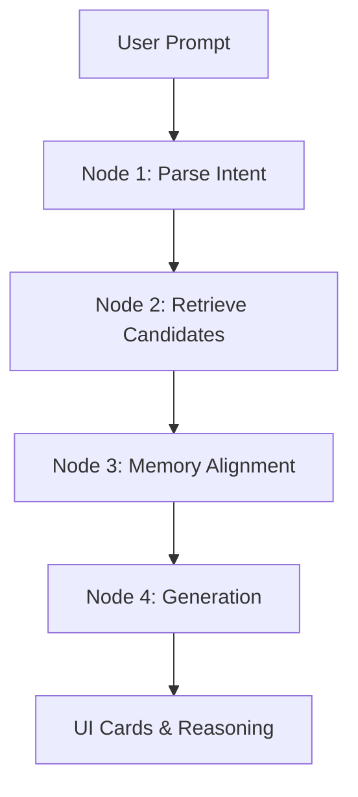

# RecAgent Suite: Autonomous Personalization & Recommendation Engine

An agentic recommendation suite built with **Streamlit**, **PyTorch**, and **SQLite**. The system integrates a dynamic, cognitive memory architecture (hierarchical belief-state network) with deep learning sequence models to provide context-aware, personalized recommendations for games and movies.

---

## Key Features

*   **Dual-Engine Portals**:
    *   **Video Games Portal**: Employs a deep sequential recommender system (Transformer/GRU fallback) trained on clickstream logs.
    *   **Movies Portal**: Employs real-time SQL candidate filtering and keyword-extracted search boosting.
*   **Hierarchical Belief Memory**: Dynamically learns, scales, and decays user preferences across multiple genres in real-time based on click signals.
*   **ReAct Agentic Reasoning Loop**: Parses user intent, fetches candidates, aligns recommendations with user memory, and drafts natural language reasoning explaining "why" each item was picked.
*   **Interactive Agent Mind Dashboard**: Displays live execution steps, current active genre beliefs, and real-time Chain-of-Thought logs for complete execution transparency.

---

## Architecture & Workflow

The system executes recommendations through a structured 4-step control graph:



1.  **Parse Intent (`agent_loop.py`)**: Filters stopwords, extracts query filters (price limit, rating floor), and isolates search terms (e.g. `['avengers']`).
2.  **Retrieve Candidates (`deep_model.py` / SQLite)**: Queries SQLite for constraints and runs next-item sequence predictions through a deep PyTorch model.
3.  **Memory Alignment (`memory.py`)**: Evaluates candidate matches against the user's active preference belief strengths and boosts exact keyword hits.
4.  **Generation**: Triggers the LLM (or a deterministic rule-based template) to render the cards and explain the recommendations.

---

## Project Structure

```
├── app.py                 # Streamlit multi-page frontend and dashboard
├── agent_loop.py          # StateGraph controller orchestrating the agent nodes
├── deep_model.py          # PyTorch GRUSeqRec model definition & training
├── memory.py              # User belief-state tracker & profile memory manager
├── developer_config.json  # Config file for sidebar developer credentials
├── recommender.db         # SQLite database housing games, movies, and logs
├── recommender_model.pth  # Saved weights for the GRU recommender
└── requirements.txt       # Cloud and local dependencies
```

---

## Local Setup & Execution

### Prerequisites
*   Python 3.8+
*   pip

### Steps

1.  **Clone the Repository**:
    ```bash
    git clone https://github.com/ashwinikr295/agentic-recommender.git
    cd agentic-recommender
    ```

2.  **Install Dependencies**:
    ```bash
    pip install -r requirements.txt
    ```

3.  **Run the Web Application**:
    ```bash
    streamlit run app.py
    ```

---

## Developer
*   **Name**: Ashwini Kumar
*   **Role**: AI & Software Engineer | Full Stack Web Developer
*   **GitHub**: [ashwinikr295](https://github.com/ashwinikr295)
*   **LinkedIn**: [LinkedIn Profile](https://www.linkedin.com/in/ashwini-kumar-6928a527a/)
